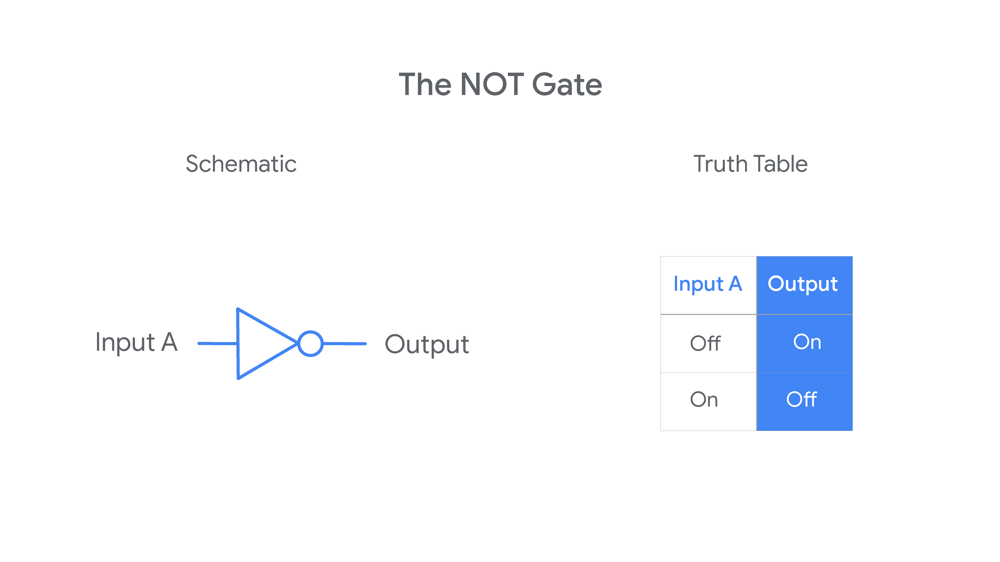
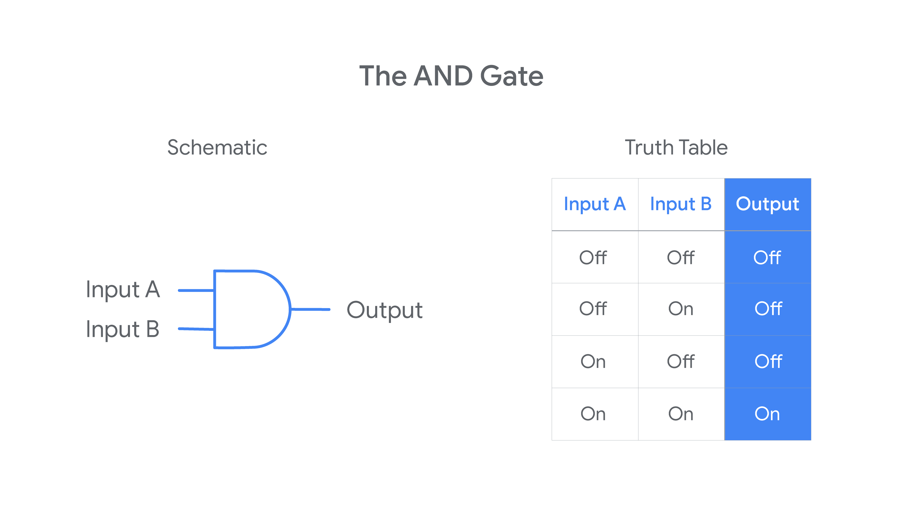
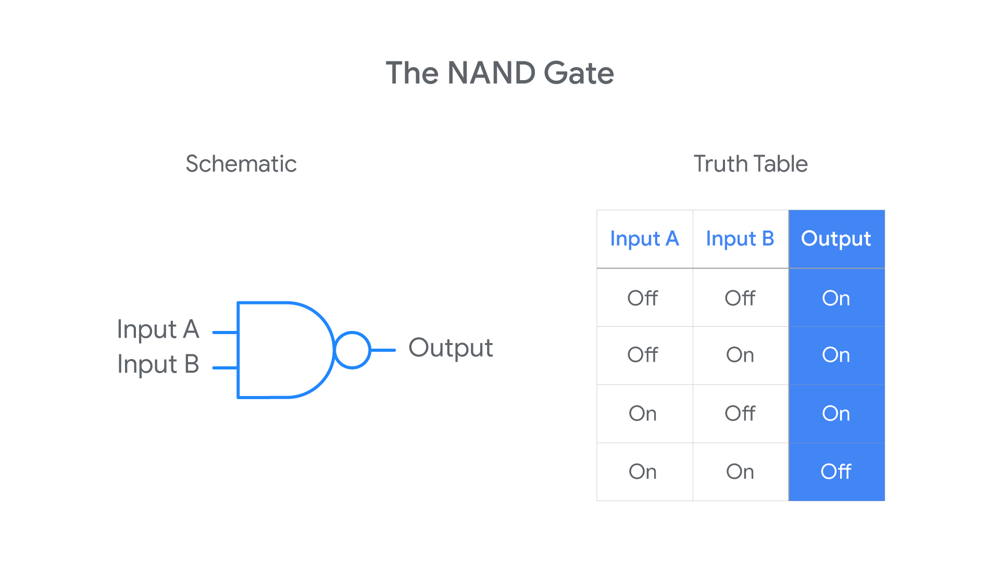
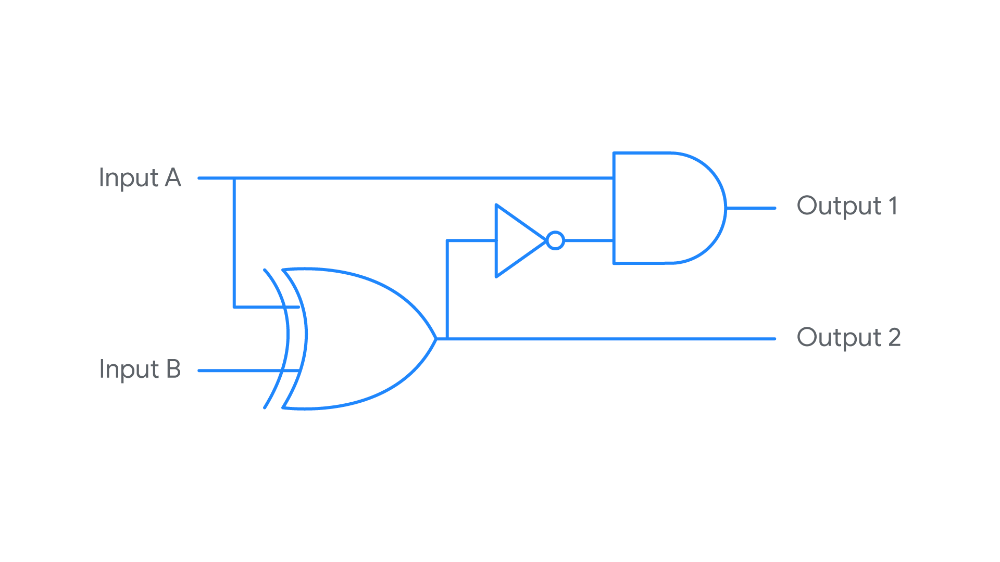
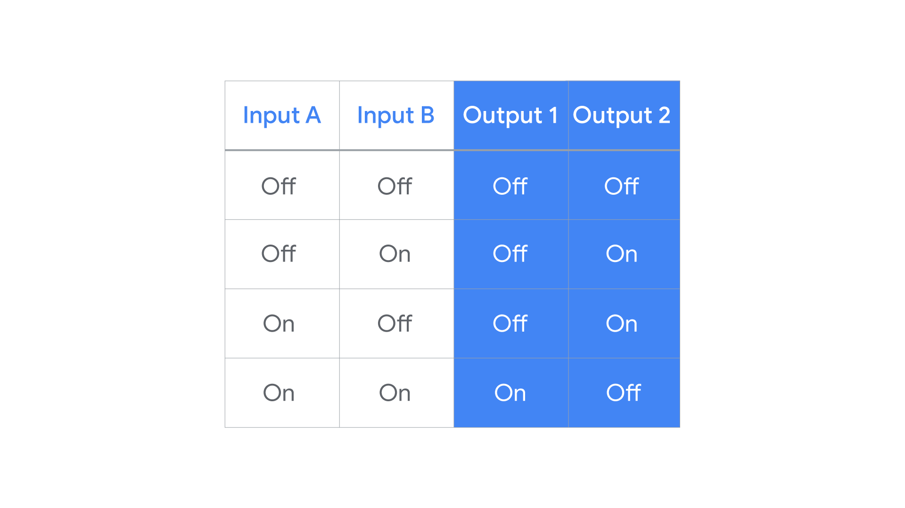

## Supplemental Reading on Logic Gates

**Logic Gates**

Knowing how logic gates work is important to understanding how a computer works. Computers work by performing binary calculations. Logic gates are electrical components that tell a computer how to perform binary calculations. They specify rules for how to produce an electrical output based on one or more electrical inputs. Computers use these electrical signals to represent two binary states: either an “on” state or an “off” state. A logic gate takes in one or more of these binary states and determines whether to pass along an “on” or “off” signal.

Several logic gates have been developed to represent different rules for producing a binary output. This reading covers six of the most common logic gates. 

**Six common logic gates**

**NOT gate** 

The NOT gate is the simplest because it has only one input signal. The NOT gate takes that input signal and outputs a signal with the opposite binary state. If the input signal is “on,” a NOT gate outputs an “off” signal. If the input signal is “off,” a NOT gate outputs an “on” signal. All the logic gates can be defined using a schematic diagram and truth table. Here’s how this logic rule is often represented:

**AND gate** 

The AND gate involves two input signals rather than just one. Having two input signals means there will be four possible combinations of input values. The AND rule outputs an “on” signal only when both the inputs are “on.” Otherwise, the output signal will be “off.”

**OR gate** 

The OR gate involves two input signals. The OR rule outputs an “off” signal only when both the inputs are “off.” Otherwise, the output signal will be “on.”

**XOR Gate** 

The XOR gate also involves two input signals. The XOR rule outputs an “on” signal when only one (but not both) of the inputs are “on.” Otherwise, the output signal will be “off.”

**NAND gate** 

The NAND gate involves two input signals. The NAND rule outputs an “off” signal only when both the inputs are “on.” Otherwise, the output signal will be “on.”

**XNOR gate** 

Finally, consider the XNOR gate. It also involves two input signals. The XNOR rule outputs an “on” signal only when both the inputs are the same (both “On” or both “Off”). Otherwise, the output signal will be “off.”

**Combining gates (building circuits)**

Logic gates are physical electronic components. Logic gates can be linked together to create complex electrical systems (circuits) that perform complicated binary calculations. Computers are this kind of complex electrical system. 

Here is the truth table for this circuit:

This circuit uses three logic gates: an XOR gate, a NOT gate, and an AND gate. It takes two inputs (A and B) and produces two outputs (1 and 2). A and B are the inputs for the XOR gate. The output of that gate became the input of the NOT gate. Then, the output of the NOT gate became an input for the AND gate (with input A as the other). Output 1 is the output from the AND gate. Output 2 is the output from the XOR gate.

**Key takeaways**

Logic gates are the physical components that allow computers to make binary calculations.

* Logic gates represent different rules for taking one or more binary inputs and outputting a specific binary value (“on” or “off”).
* Logic gates can be linked so that the output of one gate serves as the input for other gates.
* Circuits are complex electrical systems built by linking logic gates together. Computers are a complex electrical system of logic gates.
