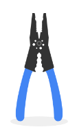
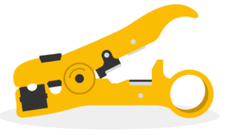
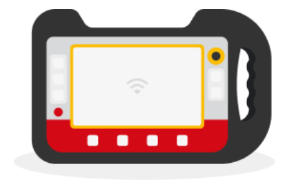
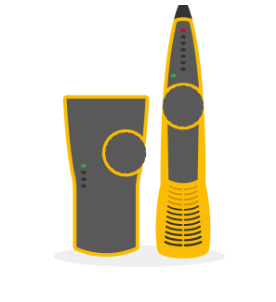
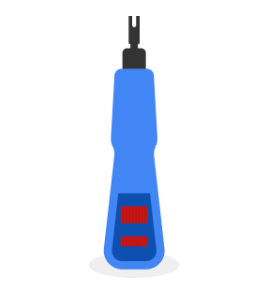
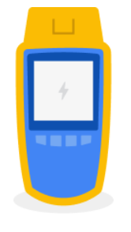
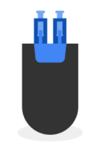
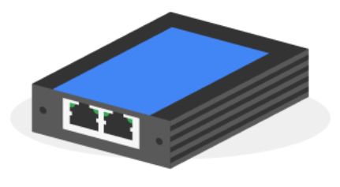

Cabling Tools
=============

As we have covered, ports and patch panels are part of the Physical Layer. Cabling tools are an expansion of the Physical Layer.  In this reading, you will learn more about cabling tools, what they look like, and what they are used for.

### Crimper

 A crimper is a hand-held tool that looks like a set of pliers. It is used to squeeze down or crimp wires.

### Cable Stripper

 A cable stripper is another handheld device that also looks like pliers. It's purpose is to remove the protective rubber coating from cables.

### Wi-Fi Analyzer

 A WiFi analyzer is a scanner that analyzes the power and quality of the WiFi in an area. It also collects data about the WiFi and its circumstances.

### Toner Probe

 A toner probe is a part of a set of devices that are used for finding ethernet and other internet connectors. One device plugs into a cable, while the other device, the tone probe, uses a tone which gets louder as it gets closer to the device plugged into the cable. (Meyers, 2022).

### Punch Down Tool

A Punch Down Tool or Krone Tool is used for punching down wires into punch down panels or jacks. First the protective covering is taken off the wires, then the wires are punched into place.

### Cable Tester

 A cable tester digitally measures integrity of the cable for compliance with developed cabling standards. They measure several parameters:

* Attenuation

* Impedance

* Noise

* Near-End Crosstalk

* Attenuation to Crosstalk Ratio (ACR)

* PowerSum NEXT (Network Encyclopedia, 2022).

### Loopback Plug

A loopback plug is a device that tests ports. Wires are connected in a loop that sends traffic back to the port after it receives it.

### Network Tap

 A network tap is a device that copies traffic information for use in monitoring devices. It is an external device.

Meyers, M. (2022). _Using a toner and probe._ \[Video\].

[https://www.oreilly.com/library/view/comptia-network-certification/9781803249797/video5\_8.html](https://www.oreilly.com/library/view/comptia-network-certification/9781803249797/video5_8.html)

Network Encyclopedia.(2022). _What is a cable tester?_

[https://networkencyclopedia.com/cable-tester/](https://networkencyclopedia.com/cable-tester/)

Gig|Mocha.com.(2022). _What is a network loopback plug._

[https://gigmocha.com/what-is-a-network-loopback-plug/](https://gigmocha.com/what-is-a-network-loopback-plug/)
