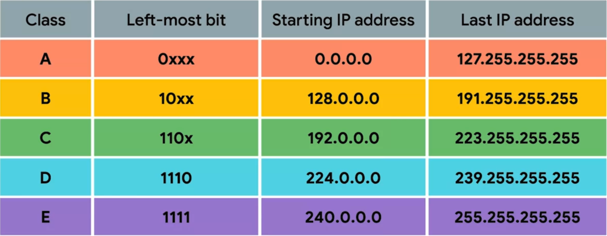

# Notes 

## Main Points about IP Datagrams

* IP datagrams are packets of data sent over a network using the Internet Protocol (IP).
* They consist of a header and a payload.
* The header contains information like source and destination IP addresses, protocol, and length.
* IP datagrams are encapsulated within Ethernet frames for transmission.
* Important fields in the header include:
  * Version
  * Header length
  * Service type
  * Total length
  * Identification
  * Flags
  * Fragmentation offset
  * Time to live (TTL)
  * Protocol
  * Header checksum
  * Source IP address
  * Destination IP address
* IP datagrams can be fragmented if they are too large.
* The TTL field limits the number of router hops a datagram can traverse.
* The payload of an IP datagram can be a TCP or UDP packet.

## Main Points on IP

* IP addresses are used to identify devices on a network.
* IP addresses are made up of four octets, each of which can take a value between 0 and 255.
* The first octet of an IP address is used to identify the network, and the remaining three octets are used to identify the host.
* There are three main types of address classes: Class A, Class B, and Class C.
* Class A addresses are used for large networks, Class B addresses are used for medium-sized networks, and Class C addresses are used for small networks.
* CIDR is a newer system that has replaced the address class system. CIDR allows for more efficient use of IP addresses.
* Multicasting is a technique that allows a single IP datagram to be sent to multiple hosts at the same time.
### IP Address Classes and IP Numbers

Class | First Octet Range | Number of Networks | Number of Hosts per Network
-|-|-|-
A|0-127 | 128	| 16,777,216
B|128-191 | 16,384	| 65,536
C|192-223 | 2,097,152	| 256

#### Examples

* **Class A:** 10.0.0.1
* **Class B:** 172.16.0.1
* **Class C:** 192.168.1.1

## Subnet Summary:

* Subnet IDs are used to further divide IP addresses into smaller networks.
* Subnet masks are binary numbers that specify which bits of an IP address represent the subnet ID.
* The size of a subnet is determined by its subnet mask.
* A subnet mask of 255.255.255.0 indicates that only the last octet is available for host IDs.
* A subnet mask of 255.255.255.224 indicates that five bits are available for host IDs, resulting in a total of 32 addresses.
* Subnet masks can be written in shorthand notation using a slash followed by the number of ones in the mask (e.g., /27).

```
IP Address: 9.100.100.100
Subnet Mask: 255.255.255.224

Binary Representation:

IP Address: 00001001.01100100.01100100.01100100
Subnet Mask: 11111111.11111111.11111111.11100000

Shorthand Notation: /27

Explanation:

The subnet mask has 27 ones followed by 5 zeros. Therefore, the shorthand notation is /27.
```
