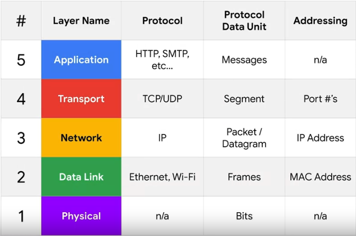

# Notes Module 3

## TCP/IP

### Physical layer

* Examples: copper cables, fiber optic cables, wireless connections

### Data link layer

* Examples: Ethernet, Wi-Fi, Bluetooth

### Network layer

* Examples: IP addresses, routing tables

### Transport layer

* Examples: TCP, UDP

### Application layer

* Examples: HTTP, FTP, SMTP

## TCP Segment Structure

A TCP segment consists of a header and a data section. The header contains the following fields:

* **Source port:** The port of the service that sent the segment.
* **Destination port:** The port of the service that the segment is intended for.
* **Sequence number:** A 32-bit number that identifies the segment's position in a sequence of segments.
* **Acknowledgment number:** A 32-bit number that indicates the next segment that the sender expects to receive.
* **Data offset:** A 4-bit number that indicates the length of the TCP header.
* *Control flags:* Six bits that are used to control the behavior of the TCP connection.
* **TCP window:** A 16-bit number that specifies the range of sequence numbers that the sender can send before receiving an acknowledgment.
* **Checksum:** A 16-bit number that is used to check for errors in the segment.
* **Urgent pointer:** A 16-bit number that is used to indicate the location of urgent data in the segment.
* **Options**: A variable-length field that is used to specify additional options for the TCP connection.
* **Padding:** A variable-length field that is used to ensure that the data payload section begins at the expected location.

The data section of the TCP segment contains the data that is being transmitted.

### TCP Control Flags

TCP uses six control flags to establish and close connections:

* **URG:** Urgent
* **ACK:** Acknowledged
* **PSH:** Push
* **RST:** Reset
* **SYN:** Synchronize
* **FIN:** Finish

#### Establishing a TCP Connection (Three-Way Handshake)

1. Computer A sends a SYN flag to Computer B.
2. Computer B responds with a SYN/ACK flag.
3. Computer A responds with an ACK flag.

#### Closing a TCP Connection (Four-Way Handshake)

1. One computer sends a FIN flag.
2. The other computer acknowledges with an ACK flag.
3. If the other computer is also ready to close, it sends a FIN flag.
4. The first computer acknowledges with an ACK flag.

#### Additional Information

* TCP connections operate in full duplex mode, meaning both sides can send and receive data simultaneously.
* Each segment sent should be acknowledged with an ACK flag.
* A TCP connection can stay open in simplex mode with only one side closing the connection, but this is rare.

### Common TCP Socket States

* **LISTEN**: Ready and listening for incoming connections (server-side only)
* **SYN_SENT**: Synchronization request sent, but connection not yet established (client-side only)
* **SYN_RECEIVED**: Synchronization request received and SYN/ACK sent, but final ACK not yet received (server-side only)
* **ESTABLISHED**: TCP connection is working and both sides can send data
* **FIN_WAIT**: FIN sent, but corresponding ACK not yet received
* **CLOSE_WAIT**: Connection closed at TCP layer, but application hasn't released its hold on the socket
* **CLOSED**: Connection fully terminated and no further communication is possible

#### Additional Notes

* Socket states and their names can vary from operating system to operating system.
* When troubleshooting TCP layer issues, check the exact socket state definitions for the systems you're working with.

## Application Layer

* The application layer is the top layer of the TCP/IP model.
* It is responsible for providing applications with a way to communicate with each other.
* The application layer is used by a wide variety of applications, including web browsers, email clients, and file transfer programs.
* There are many different protocols used at the application layer, but they all share a common goal of providing a way for applications to communicate with each other.
* One of the most common application layer protocols is HTTP, which is used by web browsers and web servers to communicate with each other.
