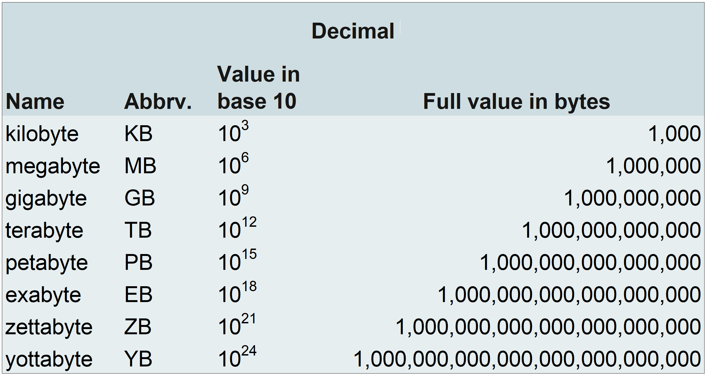
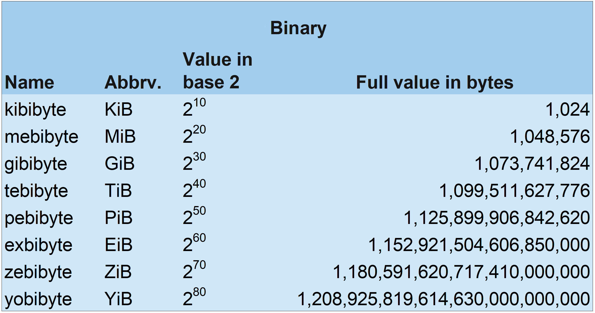

# Data Storage Measurements

In this reading, you will learn about the different names for measurements of data storage capacities and file sizes. Data storage capacity increases in step with the evolution of computer hardware technology. Larger storage capacities allow for dynamic growth in file sizes. These advances make it possible for companies like Netflix and Hulu to store thousands of feature-length films in high video quality formats. 

There are standardized sets of terms used to name the ever-expanding sizes of data storage and files. For example, the common terms used to describe file sizes and hard drive storage capacity include: bytes, kilobytes, megabytes, gigabytes, and terabytes. However, if you are a computer engineer, you might use a different set of terms. 

### Data storage measurement nomenclature

* **Decimal nomenclature:** kilobyte, megabyte, gigabyte, terabyte, petabyte, exabyte, zettabyte, yottabyte

The decimal naming system for computer storage uses the metric system of prefixes from the International System of Units: kilo, mega, giga, tera, peta, exa, zetta, and yotta.  The metric/decimal nomenclature represents a base-10 approximation of the actual amount of data storage bytes.

* **Binary nomenclature:**kibibyte, mebibyte, gibibyte, tebibyte, pebibyte, exbibyte, zebibyte, yobibyte

The binary naming system is a standard set by the International Organization for Standardization (ISO) in partnership with the International Electrotechnical Commission (IEC). Binary measurements of computer data are more accurate than decimal system measurements.

## Quantities of storage measurements

As data storage grows, the need for new terminology to describe the exponentially larger byte quantities grows too. The current byte nomenclature, mathematical representations, and storage capacities are as follows:

* **One bit:** 
    * Also called a binary digit. Stores an electric signal as 1 or 0 (absence of signal). This is the basis of the binary number system (base-2) that computers use. All numbers in a base-2 system increase exponentially as powers of 2.

* **One byte:** 
    * One byte stores eight bits of ones and zeros that translate to a symbol or basic computer instruction. 
    * Examples: 01101101 is the byte that translates to the letter “m.” The byte 01111111 tells the computer to delete the character to the right of the cursor.

* **One kilobyte (1 KB):** 
    * Kilobyte (KB) decimal format: 10^3 = 1,000 bytes
    * Kibibyte (KiB) binary format: 2^10 = 1,024 bytes
    * Decimal inaccuracy: Off by -2.4% or -24 bytes
    * Name origin: “Kilo-” is a French derivation from the Ancient Greek word for “thousand” A kilobyte is one thousand bytes.
    * 1 KB can hold: A short text file or a small icon as a 16x16 pixel .gif file.

* **One megabyte (1 MB):**
    * Megabyte (MB) decimal format: 10^6 = 1,000,000 bytes
    * Mebibyte (MiB) binary format: 2^20= 1,048,576 bytes
    * Decimal inaccuracy: Off by -4.9% or -48,576 bytes
    * Name origin: “Mega-” is derived from the Ancient Greek word for “large.” A megabyte is a large number of bytes.
    * 1 MB can hold: Approximately one minute of music in a lossless .mp3 format or a short novel.

* **One gigabyte (1 GB):**
    * Gigabyte (GB) decimal format: 10^9 = 1,000,000,000 bytes
    * Gibibyte (GiB) binary format: 2^30 = 1,073,741,824 bytes
    * Decimal inaccuracy: Off by -7.4% or -73,741,824 bytes
    * Name origin: “Giga-” is derived from the Ancient Greek word for “giant.” A gigabyte is a giant number of bytes.
    * 1 GB can hold: Between 2.5-3 hours of music in .mp3 format or 300 high-resolution images.

* **One terabyte (1 TB):** 
    * Terabyte (TB) decimal format: 10^12 = 1,000,000,000,000 bytes
    * Tebibyte (TiB) binary format: 2^40 = 1,099,511,627,776 bytes
    * Decimal inaccuracy: Off by -10.0% 
    * Name origin: “Tera-” is a shortened form of “tetra-”, derived from the Ancient Greek word for “four.” (10^12  = 1000^4). “Tera-” in Ancient Greek means “monster.” A terabyte is a monstrously large number of bytes.
    * 1 TB can hold: Approximately 200,000 songs in .mp3 format or 300 hours of video.

* **One petabyte (PB):** 
    * Petabyte (PB) decimal format: 10^15 = 1,000,000,000,000,000 bytes
    * Pebibyte (PiB) binary format: 2^50 = 1,125,899,906,842,624 bytes
    * Decimal inaccuracy: Off by -12.6%
    * Name origin: “Peta-” is derived from the Ancient Greek word “penta” meaning five (10^15 = 1000^5).
    * 1 PB can hold: The content from 1.5 million CD-ROM discs or 500 billion pages of text.

* **One exabyte (EB):** 
    * Exabyte (EB) decimal format: 10^18 = 1,000,000,000,000,000,000 bytes
    * Exbibyte (EiB) binary format: 2^60 = 1,152,921,504,606,846,976 bytes
    * Decimal inaccuracy: Off by -15.3% 
    * Name origin: “Exa-” was derived from the Ancient Greek word for six (10^18 = 1000^6).
    * 1 EB can hold: Approximately 11 million movies in 4k video resolution or 3,000 copies of the entire United States Library of Congress.

* **One zettabyte (ZB):** 
    * Zettabyte (ZB) decimal format: 10^21 = 1,000,000,000,000,000,000,000 bytes
    * Zebibyte (ZiB) binary format: 2^70 = 1,180,591,620,717,411,303,424 bytes
    * Decimal inaccuracy: Off by -18.1%
    * Name origin: “Zetta” was derived from the Latin word “septem” which means seven (10^21 = 1000^7).
    * 1 ZB can hold: Seagate reports one zettabyte can hold 30 billion movies in 4k video resolution.

* **One yottabyte (YB):** 
    * Yottabyte (YB) decimal format: 10^24 = 1,000,000,000,000,000,000,000,000 bytes
    * Yobibyte (YiB) binary format: 2^80 = 1,208,925,819,614,629,174,706,176 bytes
    * Decimal inaccuracy: Off by -20.9%
    * Name origin: “Yotta” is Ancient Greek for eight (10^24 = 1000^8). 
    * 1 YB can hold: In 2011, a cloud storage company estimated that one yottabyte could hold the data of one million data centers. 

