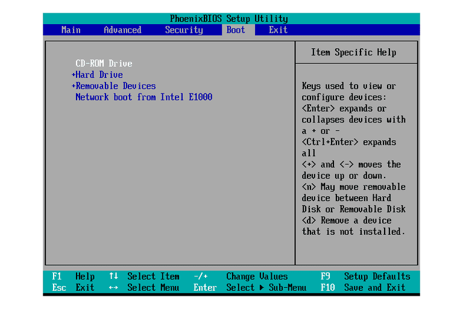

Boot Methods Best Practices
===========================

The most common way to boot a computer is to simply push the power button and allow the normal startup process to run. But what happens if the normal startup process becomes corrupted and the computer will not boot? Or maybe you would like to run a computer on a different operating system than the one specified by your normal boot process. For situations like these, you have several options for booting your operating system. This reading covers the various methods you can use to boot a computer.

The boot process
----------------

When your computer is powered on, the BIOS/UEFI (BIOS) runs a series of diagnostic tests to make sure that the computer is in proper working order. The BIOS is a low-level software that initializes a computer's hardware to make sure everything is good to go. A boot device is selected based on a boot order that is configured in the BIOS. Devices that are attached to your system, like hard drives, USB drives, and CD drives are checked in this configured boot order and the computer searches these devices for a small program called a “bootloader.” Once your computer finds a bootloader on a device, it executes this program. The bootloader program then initiates a process that loads the specific operating system setup that you want to use.

You can choose a computer’s boot method by telling the BIOS on which device to search for the bootloader. If you want to run an OS setup that’s stored on a USB drive, you can configure the boot order in your computer’s BIOS to search for a bootloader on a USB drive first.

Configuring boot options
------------------------

Boot order is the order in which a computer chooses which boot files to use to startup. The boot order determines your boot method. To set the boot order for a computer, you need to enter the BIOS and configure the boot options.

To enter your computer’s BIOS on a Windows or Linux computer, power on the system and look for an on-screen message that says which function key you should press to enter setup. The function keys used for entering the BIOS vary between computer manufacturers and the version of BIOS. Some of the more common function key messages are "Press DEL to enter SETUP," "F2=SETUP," or "Press F12 to enter SETUP." If booting macOS, press and hold the Option key at startup. This will open up the Startup Manager, which will scan your computer and identify bootable devices. Then you can choose the bootable device you want to use.

If you press the specified function key during the Windows or Linux power up process (before the OS begins to load), you will open your BIOS program. A BIOS screen will look similar to this:

The BIOS screen will vary depending on your computer manufacturer and BIOS version, but all BIOS programs will feature a Boot Options menu. The Boot Options menu is where you can set your preferred boot method.

The boot options menu lists all the devices attached to your system where it may find a bootloader program. These include devices like internal hard drives, USB drives, CD drives, as well as other storage options, like network storage or cloud storage. In the BIOS boot options menu you can set the specific order you want to search these devices for the bootloader that will load your OS setup. The BIOS will run the first bootloader that it finds.

Boot method options
===================

You may find the following boot methods listed in your BIOS boot options:

External options
----------------

* **USB drive:** You use a USB drive loaded with resources needed to boot the computer. This drive is inserted into a USB port and chosen at startup.

* **Optical Media:** You use an optical media disk loaded with booting resources. This disk can be a DVD, CD, or Blu-ray disk and is loaded through the computer's optical drive.

The USB drive and optical media methods are useful for recovering a computer with a corrupted OS. They can also be used to start up a computer with a different OS. For example, you might boot a Windows computer in a Linux environment by using a USB with Linux OS. You will need to prepare these media with a bootable OS in order to use them as a boot method (see resources linked below).

* **Solid State Boot Drive:** You can use a solid state drive to boot your computer. Solid state drives do not use spinning discs or moving parts. This solid state drive can be installed in the computer or can be a smaller device such as a flash drive.

* **External hot-swappable drive:** You may boot from an external hard drive that can be moved between computers without turning it off.

* **Network boot:** You can boot an operating system directly from a local area network (LAN) without using a storage device. Your computer must be connected to a LAN for this option. The network boot is used when the computer does not have an OS installed, among other things. To boot from a network, you will need to set up the Preboot Execution Environment (PXE) capability on the BIOS and have the network environment prepared for this type of request (see resources linked below).

* **Internet-based boot:** You boot the computer from an internet source, as long as it is a secure source. If you are in charge of a network and your server is down for any reason, you can use this boot method to remotely power on the server and restart network operations. Internet-based boot can be achieved in one of two ways:

1. Remote access. Remote Access Controller (IPMI or similar) has to be enabled on the BIOS and the computer needs to have a Remote access control device, such as IDRAC (see resources linked below).

2. Wake on LAN (WoL). This process requires the WoL option enabled on the BIOS  (see resources linked below). The WoL instruction should come from a device in the network or use a WoL gateway, and the network card should have WoL capability.

Internal options
----------------

**Disk partitions:** You can create partitions on your computer’s drive so that only one part of the drive runs the boot process. A common reason to partition your drive is to have two separate operating systems on your computer. For example, you could have Windows on one partition of your drive and Linux on the other. When you have two operating systems on your drive, you must choose which one will run the boot process. Having two possible systems to boot into is called dual booting.

While having two operating systems can be helpful for various reasons, it is especially helpful when one system is failing or unable to boot. If this happens, you can still boot the computer using the other system and troubleshoot from there.

Key Takeaways
=============

There are multiple ways to boot a computer.

* A computer can be partitioned into different operating systems and you can select which OS to use when booting.

* You can boot from an external tool. External tools include USB drives, optical media, solid state boot drives, external hot-swappable drives, network booting, and internet-based booting.

* Choosing a boot method on startup varies depending on which operating system you use.

**Resource Links:**

* [How to make a bootable CD/DVD/USB to install windows](https://www.makeuseof.com/tag/make-bootable-usb-cd-dvd-install-windows-using-iso-file/)

* [How to build your own bootable Linux Live CD](https://www.makeuseof.com/tag/build-bootable-linux-live-cd/)

* [Create a bootable installer for macOS](https://support.apple.com/en-us/HT201372)

* [What is preboot execution environment (PXE)?](https://www.techtarget.com/searchnetworking/definition/Preboot-Execution-Environment)

* [How to set up PXE boot for UEFI hardware](https://www.redhat.com/sysadmin/pxe-boot-uefi)

* [Installing and configuring the RAC software](https://cs.uwaterloo.ca/~brecht/servers/docs/PowerEdge-2600/en/ERA/rac34c6.htm)

* [How to enable and use Wake on LAN (WoL) on Windows 10](https://www.windowscentral.com/how-enable-and-use-wake-lan-wol-windows-10)
