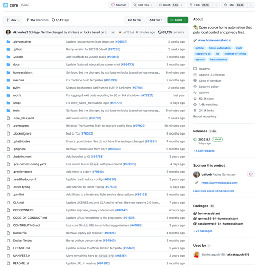
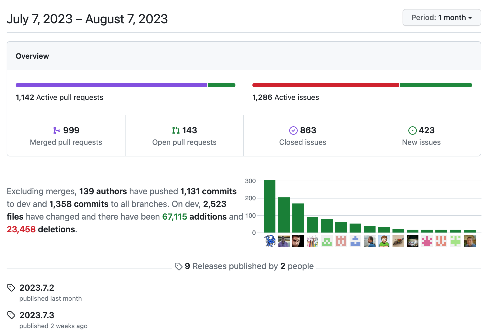
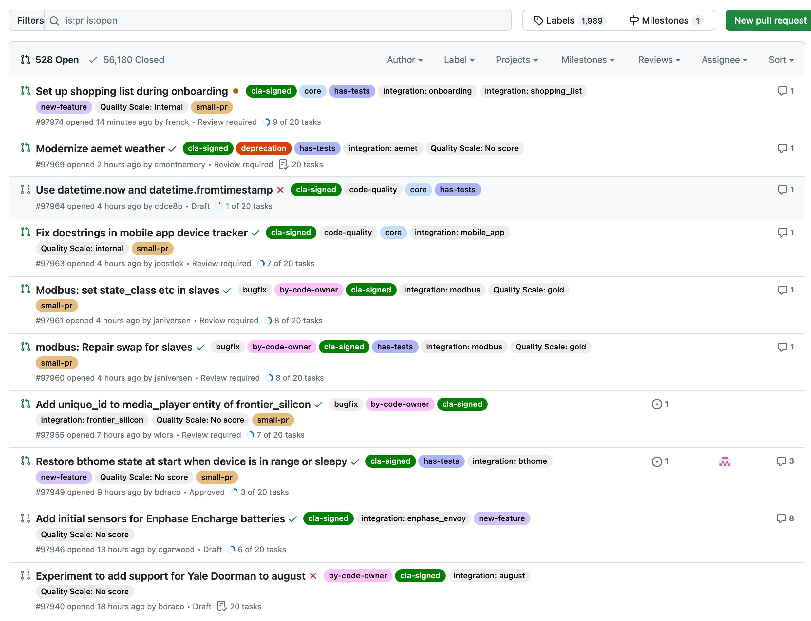
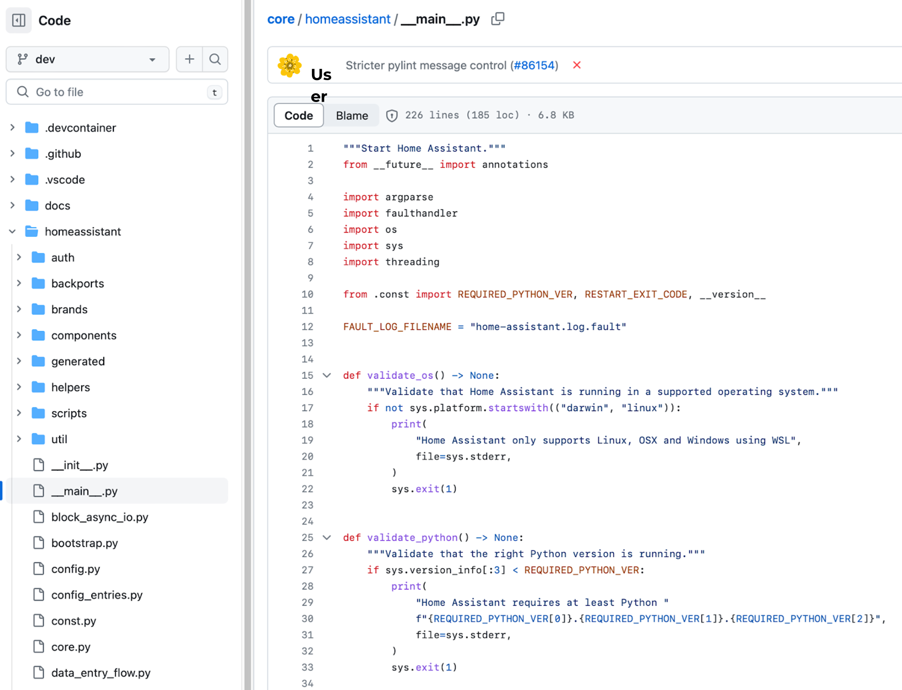
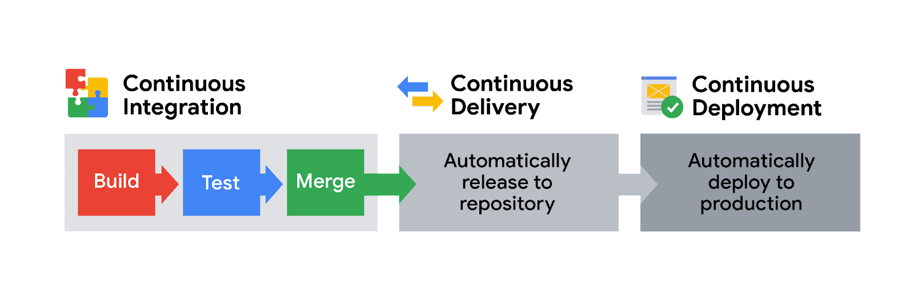

Continuous integration, delivery, and deployment
================================================

Continuous integration, delivery, and deployment, or CI/CD, refers to the automation of an entire pipeline of tools that build, test, package, and deploy an application whenever a developer commits a code change to the source control repository.

Continuous integration (CI) automatically builds, tests, and integrates code changes within a shared repository. Then, continuous delivery (CD) automatically delivers code changes to production-ready environments for approval, and continuous deployment (CD) automatically deploys those code changes directly to production.

Continuous integration
----------------------

CI is a key best practice in DevOps. As the first stage of the automation process in the development lifecycle, developers integrate their code changes early and often to a shared source code repository. This shared repository is the solution to having too many separate iterations of a software or app in development at the same time. It can also:

* Reduce the risk of having multiple pieces—which may be created independently—conflicting with each other

* Save time throughout the development lifecycle by allowing you to identify and address any issues or conflicts as they arise rather than at the end of a phase

* Reduce the amount of time spent on fixing bugs and regression

Continuous delivery and deployment
----------------------------------

An important note: Continuous delivery and continuous deployment are related concepts that are sometimes used interchangeably. While they’re both about automating later stages of a DevOps pipeline, you can use either to show what is happening during automation. For example, continuous delivery means that any changes a developer makes to an application are automatically released to a repository like GitHub and then deployed by the operations team. This ensures that minimal effort is required to deploy new code. It also includes test and code release automation at every stage, beginning with code changes and ending with the delivery of production-ready builds.

Continuous deployment is an extension of continuous delivery and refers to the automatic deployment of an app or any developer changes from the repository to production. This helps to prevent overloading the operations teams and automates the next stage in the pipeline. However, continuous deployment relies heavily on the success of test automation, so it’s important that your testing is written to accommodate the various testing and release stages in the DevOps lifecycle.

Key takeaways
-------------

The idea of CI/CD is to bring efficiency to your software release process so engineers can write code, test, and deploy at any time without impacting your customers. Whenever your team wants to roll out new features either due to business needs, improvement, or hotfixes, as quickly as possible, CI/CD can help you do that in an organized and controlled manner.
