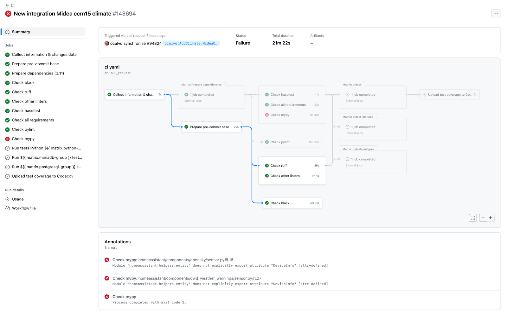

Containers with Docker and Kubernetes
=====================================

Here’s what you should have learned so far:

* **Containers** are applications that are packaged together with their configuration and dependencies. They’re used to share applications, post applications to a server for review, test different instances of the same application, and separate a large application into smaller, independent parts, making them easier to manage during the stages of the software development lifecycle.

* **Docker** is the most common way to package and run applications in containers. It can build container images, run containers, and manage container data through volumes and container networks to make the running software talk to the external world.

* **Kubernetes** is a portable and extensible platform to assist developers with containerized applications. It’s a tool that developers use while working in Docker to run and manage Docker containers, allowing you to deploy, scale, and manage containerized applications across clusters.

In this reading, you will learn about how containers are used in the CI/CD pipeline.

Containers in the CI/CD pipeline
--------------------------------

Continuous integration and continuous delivery/deployment (CI/CD) is the automation of an entire pipeline of tools that build, test, package, and deploy an application whenever developers commit a code change to the source control repository. Feedback can be provided to developers at any given stage of the process. A pipeline is an automated process and set of tools that developers use during the software development lifecycle. In a pipeline, the steps of a process are carried out in sequential order. The reason behind this is that if any step fails, the pipeline can stop without deploying the changes. The pipeline stops executing the steps and marks the job as failed. The following image is what this looks like in Github Actions.

Using containers in the CI/CD pipeline can bring developers additional flexibility, consistency, and benefits to building, testing, packaging, and deploying an application. Because containers are lightweight, they allow for a faster deployment of the application. Containers help eliminate the common “works on my machine” syndrome.

Docker images contain the application code, data files, configuration files, libraries, and other dependencies needed to run an application. Typically, these consist of multiple layers in order to keep the images as small as possible. Container images allow developers to run tests, conduct quality performance checks, and ensure each code change is tested and works as expected before being deployed.

Kubernetes is a tool for organizing, sharing, and managing containers. This powerful tool gives programmers and developers the ability to scale, duplicate, push updates, roll back updates and versions, and operate under version control.

Another advantage of using containers in a CI/CD pipeline is that developers are able to deploy multiple versions of an application at the same time without interfering with one another. It can reduce the number of errors from configuration issues and allow delivery teams to quickly move these containers between different environments, like from build to staging and staging to production. And lastly, using containers in a CI/CD pipeline supports automated scaling, load balancing, and high availability of applications creating robust deployments.

Key takeaways
-------------

Using containers in the CI/CD pipeline with both Docker and Kubernetes benefits developers by creating a more seamless process for building, testing, packaging, and deploying an application. Containers provide a more reliable way to work with applications at any stage in the pipeline process.
