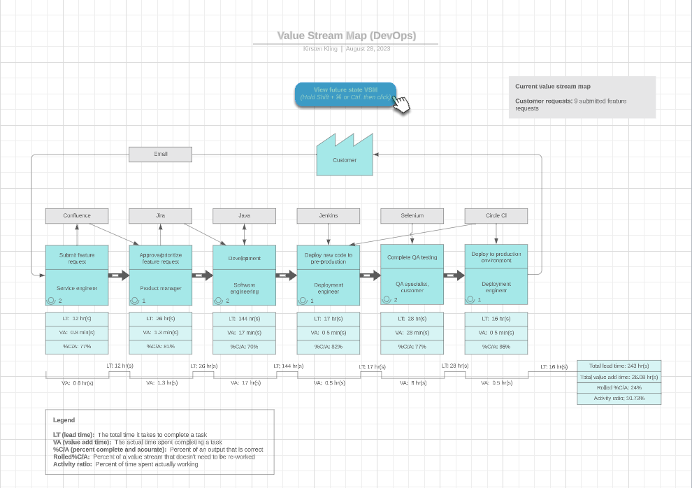
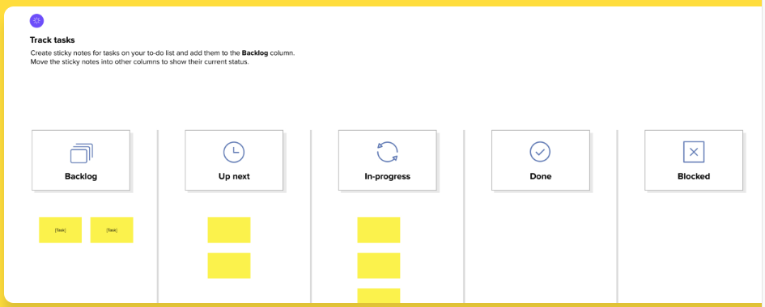

Value stream mapping
====================

You’ve learned that the “CD” in CI/CD can stand for continuous delivery and continuous deployment. They’re related concepts that are sometimes used interchangeably. They’re both about automating later stages of a DevOps pipeline, but you can use either to show what is happening during automation. Continuous delivery means that any changes a developer makes to an application are automatically released to a repository like GitHub and then deployed by the operations team. Continuous deployment is an extension of continuous delivery and refers to the automatic deployment of an app or any developer changes from the repository to production, which helps to prevent overloading the operations teams and automates the next stage in the pipeline.

In this reading, you’ll learn about value stream mapping (VSM), the key components of VSM, the benefits of VSM, and its significance in process improvement and waste reduction.

Value stream mapping (VSM)
--------------------------

Value stream mapping (VSM) is a technique used to analyze, design, and manage the flow of materials and information required to bring a product to a customer. Also known as a material and information flow map, VSM can help you identify bottlenecks in your value stream, inefficiencies in your process, and current areas of improvement. It can also help to reduce the number of steps in your process and help you visualize where handoffs occur. This way, you can identify where wait time is preventing work from moving through your system.

A significant goal of VSM is to reduce waste.

Another goal of a VSM is to increase the efficiency of your processes. To do this, create a detailed map of all the necessary steps involved in your business process with a diagram or a flowchart. Consider the example below:

This diagram outlines these steps:

1. **Define the problem.** What are you trying to solve or achieve?

2. **List the steps in your current process.** For each step, make sure to note the amount of time needed, any inputs and outputs, and the resources—both people and materials—necessary to complete each step.

3. **Create and organize the map using the above data.** Your goal is to illustrate the flow of your process, so begin with the start and finish with the end of your process. If you need help organizing the flow, think back to the steps in the software development lifecycle and use that as a guide to organize your steps.

4. **Find areas that can be improved.** Gather information about your current process by answering questions like:

    1. Can some tasks be done in parallel?

    2. Can tasks be reordered to improve efficiency?

    3. Can tasks be automated to reduce the amount of manual labor?

5. **Update the map with your findings.** This will show you where you need to make improvements or change your process.

6. **Implement the new process.** But don’t stop here! If this new process works well for your project—great! Keep in mind that coding, software, programs, apps—everything digital—are constantly updating to meet client or business needs. It can be helpful to implement an iterative process—either manual or automated—to make sure that any new hiccups in your process can be identified and addressed before they become a larger issue.

For more information and an explanation of how value maps benefit DevOps, see the article [How to Use Value Stream Mapping in DevOps](https://www.lucidchart.com/blog/value-stream-mapping-for-devops) on the Lucidchart website.

In software development, a kanban board is probably the best and most common way of visualizing VSM. Kanban is the practice of visualizing tasks in a grid. Each column in the grid represents one of the states a task may be in, such as “to do,” “in progress,” or “done.” As a task progresses, it moves from left to right across the grid. Your “in progress” column can be broken down further into the steps of your process. In software development, this can be the steps of the software development lifecycle like plan, design, build, test, and review for feedback.

virtual post-it notes with information about the project.

You can add as many columns as you need to your VSM or kanban board. The more information you have, the more comprehensive your view of the process will be. This will also help you identify waste, inefficiencies, and areas of improvement.

Other common components of a VSM include: lead times, wait times, handoffs, and waste.

* **Lead time** is the length of time between when a code change is committed to the repository and when it is in a deployable state.

* **Wait time** indicates the length of time a product has to wait between teams.  

* **Handoffs** are the transfer of information or responsibilities from one party to another.

* **Waste** refers to any time you are not creating value. In software development, there are seven types of waste production.

  * Partially completed work refers to when software is released in an incomplete state. This leads to more waste because additional work is needed to make updates.

  * Extra features refers to creating waste by doing more work than is required. This may be well-intentioned but can signal a disconnect between what the customer wants and what’s being created.

  * Relearning refers to waste generated from a lack of internal documentation. This can be a result of not investigating software errors, failures, or outages when they occur and having to relearn what to do if they happen again. It also includes having to learn new or unfamiliar technologies, which can create delays or wait times in workflows.

  * Handoff waste can occur in a few places—when project owners change, when roles change, when there is employee turnover, and when there is a breakdown in the communication pipeline between teams.

  * Delays refer to when there are dependencies on coupled parts of the project. A delay in one stage or decision may create a delay in another, which can create a surge in waste.

  * Task switching refers to the waste that is generated when an individual has to jump between tasks, which involves mental context switching. This may result in the individual working more slowly and/or less efficiently.

  * Defects refers to waste that is generated when bugs are released with software. Similar to partially completed work, defects can result in extra time and money down the line, as well as delays and interruptions in workflow due to task switching.

VSM can be implemented with something as simple as sticky notes on a whiteboard, by using project tracking software (like Jira, Asana, Trello, or others), or with special purpose-built tools. Due to its visual nature, VSM can foster collaboration and communication between teams and other stakeholders.

Key takeaways
-------------

Value stream mapping, or VSM, is a technique used to analyze, design, and manage the flow of materials and information required to bring a product to a customer. It’s important because it can improve the efficiency of your software delivery process, reduce the time needed to deliver updates to your customers, and give you a competitive advantage over other businesses.

**Pro tip #1:** Don’t be surprised if your initial attempt at creating a value stream map omits some tasks that are vital to the process. Documentation isn’t perfect and neither is anyone’s memory.

**Pro tip #2:** Involve multiple coworkers in the process. This can give you the benefit of different perspectives.

**Pro tip #3:** Share the results of your work with your team so they can understand the benefit(s) of making a change in their workflow or the overall process (or both!).
