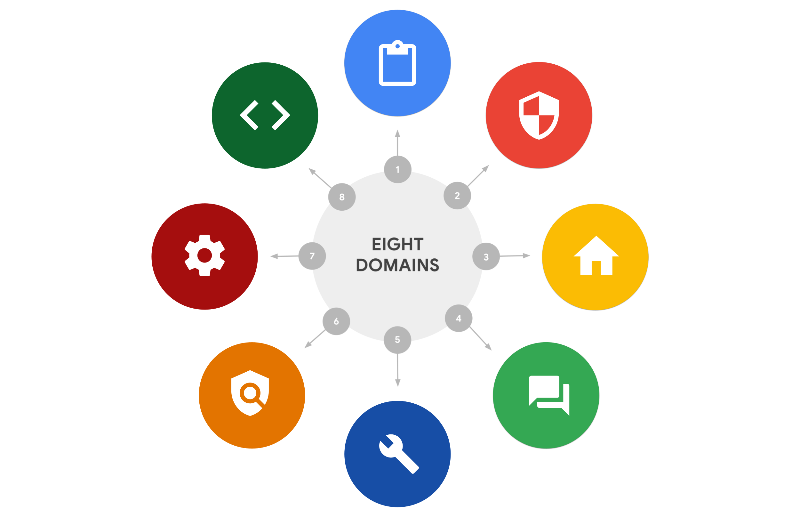

# Determine the type of attack

The eight Certified Information Systems Security Professional (CISSP) security domains... In this reading, you will learn about additional methods of attack. You’ll also be able to recognize the types of risk these attacks present.

**Attack types**

* **Password attack** 
    * A password attack is an attempt to access password-secured devices, systems, networks, or data. 
    * **Domain:** Communication and network security

* **Social engineering attack**
    * Social engineering is a manipulation technique that exploits human error to gain private information, access, or valuables. 
    * **Domain:** Security and risk management

* **Physical attack**
    *  A physical attack is a security incident that affects both digital and physical environments.  
    * **Domain:** Asset security

* **Adversarial artificial intelligence**
    * Adversarial artificial intelligence manipulates artificial intelligence and machine learning technology to conduct attacks more efficiently.
    * **Domains:** Communication and network security; Identity and access management

* **Supply-chain attack**
    * A supply-chain attack targets systems, applications, hardware, and/or software to locate a vulnerability where malware can be deployed. 
    * **Domains:** Security and risk management, Security architecture and engineering, Security operations (potentially others)

* **Cryptographic attack**
    *  A cryptographic attack affects secure forms of communication between a sender and intended recipient.
    * **Domain:** Communication and network security

**Key takeaways**

The eight CISSP security domains help an organization and its security team fortify against and prepare for a data breach... 

**Resources for more information**

* **National Institute of Standards and Technology (NIST) glossary:** [https://csrc.nist.gov/glossary](https://csrc.nist.gov/glossary) 

