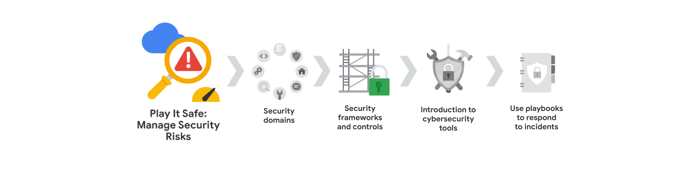
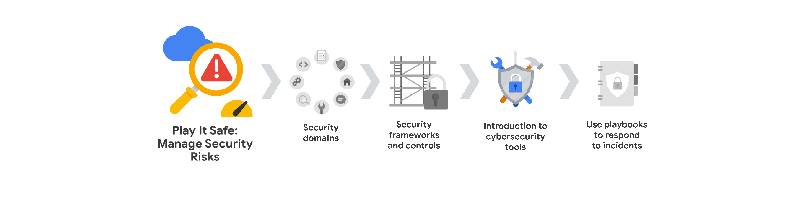
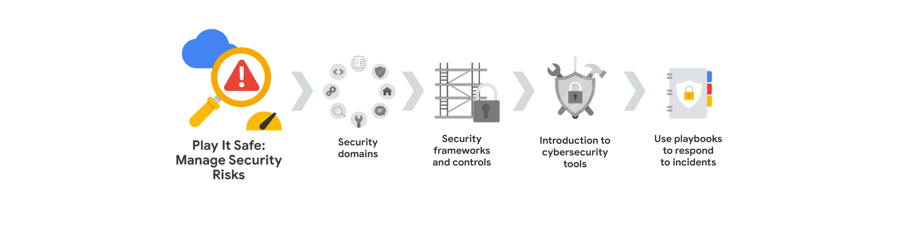

Course 2 overview
=================

Hello, and welcome to **Play It Safe: Manage Security Risks**, the second course in the Google Cybersecurity Certificate. You’re on an exciting journey!

By the end of this course, you will develop a greater understanding of the eight Certified Information Systems Security Professional (CISSP) security domains, as well as specific security frameworks and controls. You’ll also be introduced to how to use security tools and audits to help protect assets and data. These are key concepts in the cybersecurity field, and understanding them will help you keep organizations, and the people they serve, safe from threats, risks, and vulnerabilities.

Course 2 content
----------------

Each course of this certificate program is broken into modules. You can complete courses at your own pace, but the module breakdowns are designed to help you finish the entire Google Cybersecurity Certificate in about six months.

What’s to come? Here’s a quick overview of the skills you’ll learn in each module of this course.

### **Module 1: Security domains**

You will gain understanding of the CISSP’s eight security domains. Then, you'll learn about primary threats, risks, and vulnerabilities to business operations. In addition, you'll explore the National Institute of Standards and Technology’s (NIST) Risk Management Framework and the steps of risk management.

### **Module 2: Security frameworks and controls** 

You will focus on security frameworks and controls, along with the core components of the confidentiality, integrity, and availability (CIA) triad. You'll learn about Open Web Application Security Project (OWASP) security principles and security audits.

### **Module 3: Introduction to cybersecurity tools**

You will explore industry leading security information and event management (SIEM) tools that are used by security professionals to protect business operations. You'll learn how entry-level security analysts use SIEM dashboards as part of their every day work. 

### **Module 4: Use playbooks to respond to incidents**

You'll learn about the purposes and common uses of playbooks. You'll also explore how cybersecurity professionals use playbooks to respond to identified threats, risks, and vulnerabilities.