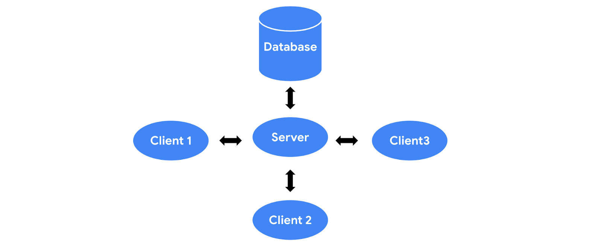
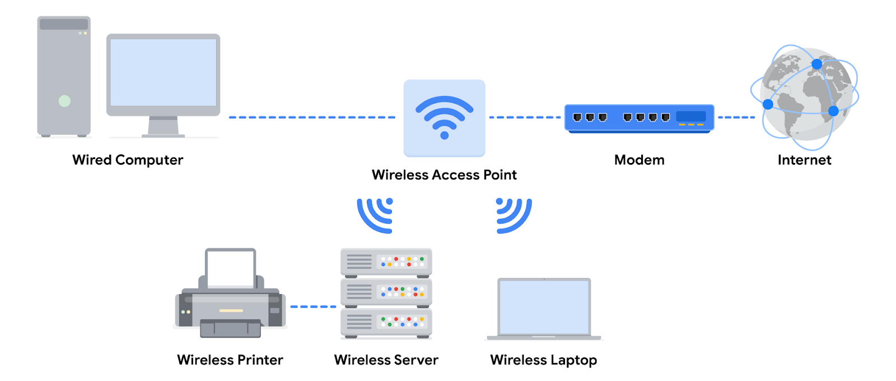

Network components, devices, and diagrams
=========================================

In this reading, you will review network devices and connections and investigate a simple network diagram similar to those used every day by network security professionals.

A foundational understanding of network architecture, sometimes referred to as network design, will help you as you learn about security vulnerabilities inherent in all networks and how malicious actors attempt to exploit them. Let’s get started!

**Network devices**
-------------------

Network devices maintain information and services for users of a network. These devices connect over wired and wireless connections. After establishing a connection to the network, the devices send data packets. The data packets provide information about the source and the destination of the data.  This is how the information is sent and received via different devices on a network.

The network is the overall infrastructure that allows devices to communicate with each other. Network devices are specialized vehicles like routers and switches that manage what is being sent and received over the network. Additionally, devices like computers and phones connect to the network via network devices.

**Note:** In this diagram, a **router** connects to the internet through a **modem**, which is provided by your internet service provider (ISP). The firewall is a security device that monitors incoming and outgoing traffic on your network. The router then directs traffic to the devices on your home network, which can include computers, laptops, smartphones, tablets, printers, and other devices. You can imagine here that the server is a file server. All devices on this network can access the files in this **server**. This diagram also includes a **switch** which is an optional device that can be used to connect more devices to your network by providing additional ports and Ethernet connections. Additionally, there are 2 routers connected to the switch here for load balancing purposes which will improve the performance of the network.

### **Devices and desktop computers**

Most internet users are familiar with everyday devices, such as personal computers, laptops, mobile phones, and tablets. Each device and desktop computer has a unique MAC address and IP address, which identify it on the network. They also have a network interface that sends and receives data packets. These devices can connect to the network via a hard wire or a wireless connection.

### **Firewalls**

A **firewall** is a network security device that monitors traffic to or from your network. It is like your first line of defense. Firewalls can also restrict specific incoming and outgoing network traffic. The organization configures the security rules of the firewall. Firewalls often reside between the secured and controlled internal network and the untrusted network resources outside the organization, such as the internet. Remember, though, firewalls are just one line of defense in the cybersecurity landscape.

### **Servers**

**Servers** provide information and services for devices like computers, smart home devices, and smartphones on the network. The devices that connect to a server are called clients. The following graphic outlines this model, which is called the client-server model. In this model, clients send requests to the server for information and services. The server performs the requests for the clients. Common examples include DNS servers that perform domain name lookups for internet sites, file servers that store and retrieve files from a database, and corporate mail servers that organize mail for a company.

### **Hubs and switches**

Hubs and switches both direct traffic on a local network. A **hub** is a device that provides a common point of connection for all devices directly connected to it. Hubs additionally repeat all information out to all ports. From a security perspective, this makes hubs vulnerable to eavesdropping. For this reason, hubs are not used as often on modern networks; most organizations use switches instead. Hubs are more commonly used for a limited network setup like a home office.

Switches are the preferred choice for most networks. A **switch** forwards packets between devices directly connected to it. They analyze the destination address of each data packet and send it to the intended device. Switches maintain a MAC address table that matches MAC addresses of devices on the network to port numbers on the switch and forwards incoming data packets according to the destination MAC address. Switches are a part of the data link layer in the TCP/IP model. Overall, switches improve performance and security.

### **Routers**

**Routers** connect networks and direct traffic, based on the IP address of the destination network. Routers allow devices on different networks to communicate with each other. In the TCP/IP model, routers are a part of the network layer. The IP address of the destination network is contained in the IP header. The router reads the IP header information and forwards the packet to the next router on the path to the destination. This continues until the packet reaches the destination network. Routers can also include a firewall feature that allows or blocks incoming traffic based on information in the transmission. This stops malicious traffic from entering the private network and damaging the local area network.

### **Modems and wireless access points**

**Modems** usually connect your home or office with an internet service provider (ISP). ISPs provide internet connectivity via telephone lines or coaxial cables. Modems receive transmissions or digital signals from the internet and translate them into analog signals that can travel through the physical connection provided by your ISP. Usually, modems connect to a router that takes the decoded transmissions and sends them on to the local network.

**Note:** Enterprise networks used by large organizations to connect their users and devices often use other broadband technologies to handle high-volume traffic, instead of using a modem.

**Wireless access point**

A **wireless access point** sends and receives digital signals over radio waves creating a wireless network. Devices with wireless adapters connect to the access point using Wi-Fi. **Wi-Fi** refers to a set of standards that are used by network devices to communicate wirelessly. Wireless access points and the devices connected to them use Wi-Fi protocols to send data through radio waves where they are sent to routers and switches and directed along the path to their final destination.

**Using network diagrams as a security analyst**
------------------------------------------------

Network diagrams allow network administrators and security personnel to imagine the architecture and design of their organization’s private network.

**Network diagrams** are maps that show the devices on the network and how they connect. Network diagrams use small representative graphics to portray each network device and dotted lines to show how each device connects to the other. By studying network diagrams, security analysts develop and refine their strategies for securing network architectures.

**Key takeaways**
-----------------

In the client-server model, the client requests information and services from the server, and the server performs the requests for the clients. Network devices include routers, workstations, servers, hubs, switches, and modems. Security analysts use network diagrams to visualize network architecture.
