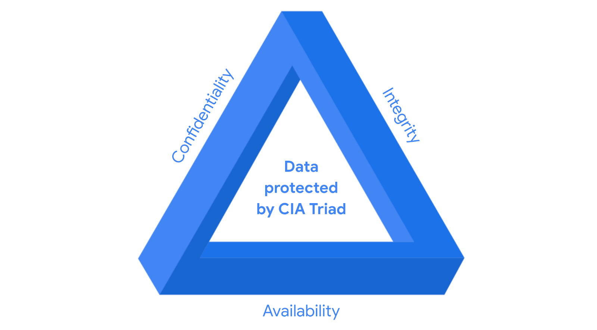

# Controls, frameworks, and compliance

Security frameworks and how they provide a structured approach to implementing a security lifecycle... In this reading, you will learn more about how security frameworks, controls, and compliance regulations—or laws—are used together to manage security and make sure everyone does their part to minimize risk.

**How controls, frameworks, and compliance are related**

The **confidentiality, integrity, and availability (CIA) triad** is a model that helps inform how organizations consider risk when setting up systems and security policies.

* **Security controls:** Safeguards designed to reduce specific security risks. 
* **Security frameworks:**  Guidelines used for building plans to help mitigate risks and threats to data and privacy.
* **Compliance:** The process of adhering to internal standards and external regulations.

**Specific controls, frameworks, and compliance**

The National Institute of Standards and Technology (NIST) is a U.S.-based agency that develops multiple voluntary compliance frameworks... Examples of frameworks include the NIST Cybersecurity Framework (CSF) and the NIST Risk Management Framework (RMF). 

**Other important frameworks and standards**

* **FERC-NERC:** Applies to organizations involved with the U.S. and North American power grid.
* **FedRAMP:** U.S. federal program standardizing security assessment for cloud providers.
* **CIS:** Nonprofit providing controls to safeguard systems against attacks.
* **GDPR:**  E.U. regulation protecting processing of E.U. residents' data. 
* **PCI DSS:** International standard for organizations handling credit card information. 
* **HIPAA:** U.S. law from 1996 to protect patients' health information.
* **ISO:**  Creates international standards related to technology, manufacturing, and management. 
* **SOC 1/SOC 2:** Focus on an organization's user access policies, assessing financial compliance and risk levels.
* **U.S. Presidential Executive Order 14028:** Released in 2021 to improve the nation's cybersecurity in response to increased threat activity. 

**Key takeaways**

In this reading you learned more about controls, frameworks, and compliance. You also learned how they work together to help organizations maintain a low level of risk.

As a security analyst, it’s important to stay up-to-date on common frameworks, controls, and compliance regulations and be aware of changes to the cybersecurity landscape to help ensure the safety of both organizations and people. 
